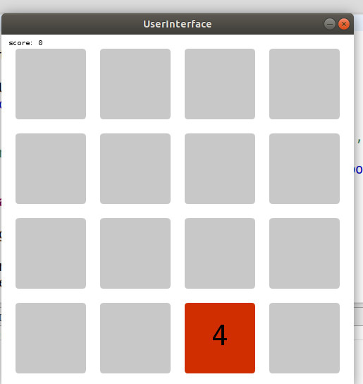

# HIMANSHU-MISHRA_2048GAME
Problem - FrontEnd And DashBoard Developer

The main file is present inside src folder.User INterface class is the main class
Used third party library  - processing.io to create a UI for the game
All the neccessary comments have been made to make the game easily understandable

You can download processing.io for java from this link - https://processing.org/download

The sample running of the game is as shown below

