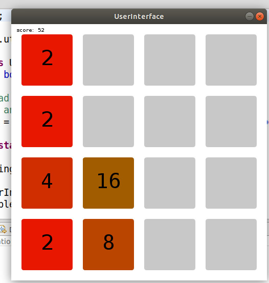
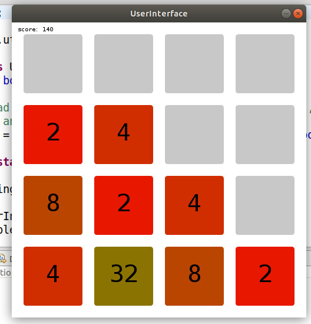
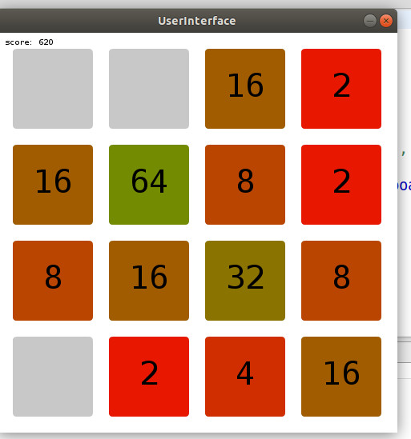

# HIMANSHU-MISHRA_2048GAME
Problem - FrontEnd And DashBoard Developer

The main file is present inside src folder.User INterface class is the main class
Used third party library  - processing.io to create a UI for the game
All the neccessary comments have been made to make the game easily understandable

You can download processing.io for java from this link - https://processing.org/download

How to play - 
 1. User has a screeen in front of him and a number either 2 or 4 in one of the cell
 2. User uses arrow keys left right up and down from the keyboard
 3. Using keys user try to get a sum of 2048 in screen
 4. If he wins game ends
 5. If he fails he is given a option to restart
 Contion for win and loss - Win is when if any cell has 2048 in it and loss is when no empty cells are left and sum is not                               2048

The sample running of the game is as shown below

